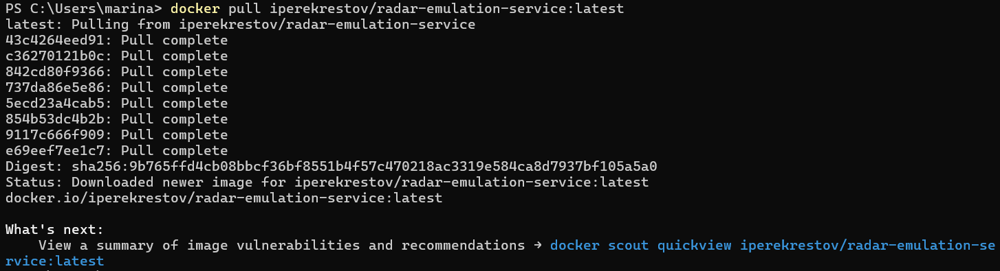
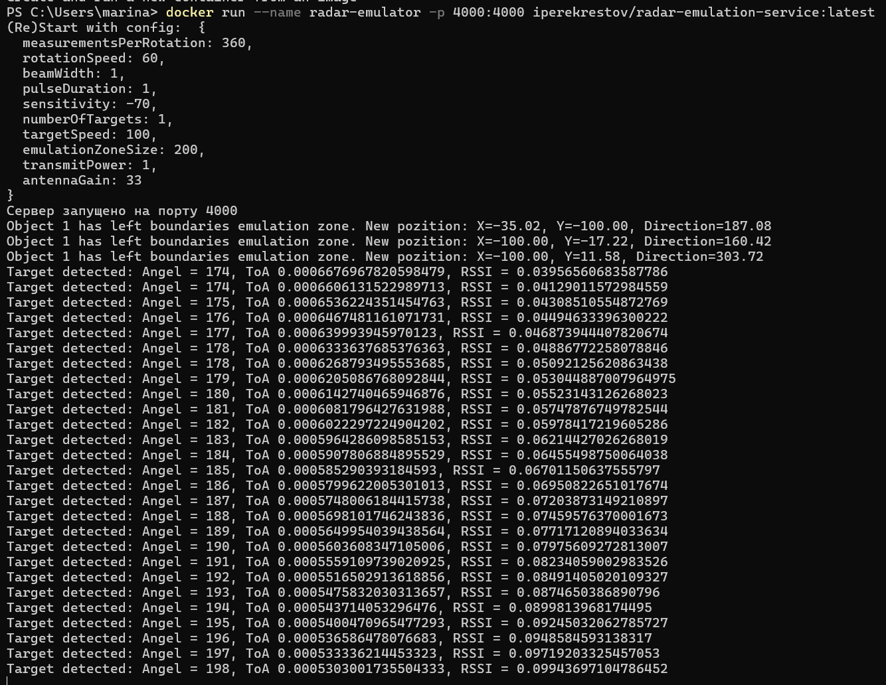
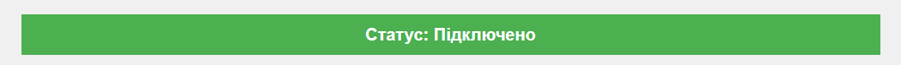
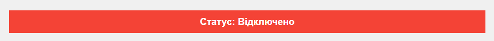
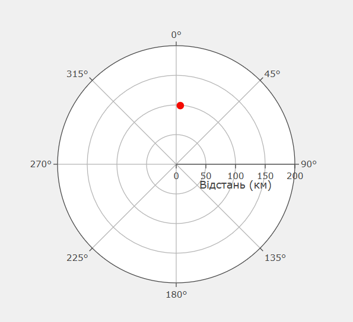
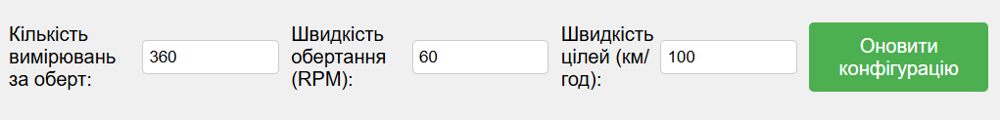
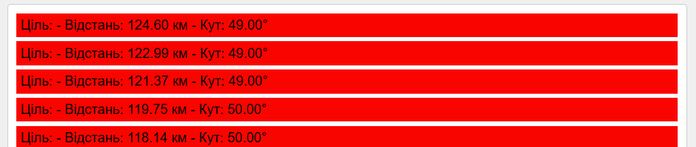
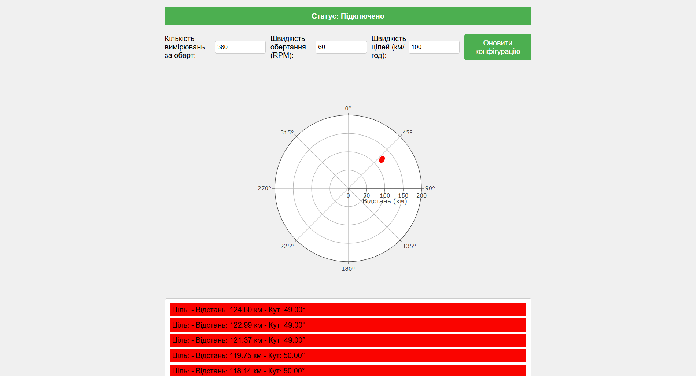

<h1> <b> Лабораторна робота №4. Розробка додатку для візуалізації вимірювань радару </b> </h1>

<b>Мета:</b> Розробити додаток, який зчитує дані з емульованої вимірювальної частини радару, наданої у вигляді Docker image, та відображає задетектовані цілі на графіку в полярних координатах.

<p><b>Завдання</b></p>
<ol>
    <li><b>Розробити додаток для відображення цілей:</b>
        <ul>
            <li>Розробити веб-додаток, який підключається до WebSocket сервера та зчитує дані про задетектовані цілі.</li>
            <li>Відобразити отримані дані на графіку в полярних координатах. Як варіант, можна використати бібліотеку Plotly або іншу бібліотеку для роботи з графіками.</li>
        </ul>
    </li>
    <li><b>Обробка та візуалізація даних:</b>
        <ul>
            <li>Обробити дані, отримані через WebSocket, і відобразити цілі на графіку.</li>
            <li>Кожна ціль повинна бути представлена як точка на графіку з координатами (кут, відстань).</li>
            <li>Додати можливість зміни параметрів вимірювальної частини радару за допомогою API запитів.</li>
        </ul>
    </li>
    <li><b>Налаштування графіка:</b>
        <ul>
            <li>Відобразити відстань у кілометрах на радіальній осі.</li>
            <li>Використати різні кольори або стилі точок для відображення різних рівнів потужності сигналів, що повертаються від цілей.</li>
        </ul>
    </li>
</ol>
<p><b>Завантаження та запуск емулятора вимірювальної частини радару:</b> Емулятор вимірювальної частини радару надається у вигляді Docker image під назвою <b>radar-emulation-service</b>. Для запуску емулятора завантажуємо Docker image з Docker Hub командою:</p>
<pre><code>docker pull iperekrestov/university:radar-emulation-service</code></pre>
<p align="left">  </p>
<p>Після цього запускаємо Docker контейнер командою:</p>
<pre><code>docker run --name radar-emulator -p 4000:4000 iperekrestov/university:radar-emulation-service</code></pre>
<p>Ця команда запускає контейнер з ім'ям <b>radar-emulator</b> і відкриває порт <b>4000</b> для з'єднання з емульованою вимірювальною частиною радару.</p>
<p align="left">  </p>

<p><b>Створення початкових налаштувань радара:</b> Початкові налаштування радара, такі як частота оновлення і потужність сигналу, визначаються в панелі керування на веб-сторінці додатка. Ці налаштування надсилаються на сервер, що дозволяє налаштувати емулятор для отримання відповідних даних.</p>

<p><b>WebSocket-з'єднання:</b> WebSocket-з'єднання встановлюється для підключення до сервера радара за адресою <b>ws://localhost:4000</b>. У разі успішного з'єднання відображається статус "Підключено".</p>
<p align="left">  </p>
<p>Якщо з'єднання обривається, додаток автоматично намагається перепідключитися через 5 секунд. Вхідні дані від радара надходять у форматі сигналів ехо, які обробляються програмою.</p>
<p align="left">  </p>

<p><b>Обробка радарних даних:</b> Дані кожного сигналу ехо містять інформацію про час проходження, який використовується для обчислення відстані до цілі. Відстань обчислюється за формулою на основі часу та швидкості світла:</p>
<p align="center">R = (c ⋅ t) / 2</p>
<p>Кожна ціль візуалізується на основі потужності сигналу, що дозволяє виділити більш потужні цілі зеленим кольором, а слабші — червоним.</p>

<p><b>Полярна діаграма:</b> Відображення цілей на полярній діаграмі здійснюється з використанням бібліотеки <b>Plotly</b>. Радіальна координата <b>r</b> представляє відстань до цілі, а кутова координата <b>theta</b> — напрямок. Графік автоматично оновлюється при надходженні нових даних від радара.</p>
<p align="center">  </p>

<p><b>Оновлення конфігурації:</b> У веб-додатку користувач може оновлювати три параметри радара: <b>кількість вимірювань за оберт</b>, <b>швидкість обертання (RPM)</b> та <b>швидкість цілей (км/ч)</b>. Ці параметри відображаються у відповідних полях вводу, і після внесення змін користувач натискає кнопку <b>«Оновити конфігурацію»</b>. Це дозволяє користувачу відправити оновлені налаштування на сервер через HTTP-запит до порту <b>4000</b>, що дає можливість оновити параметри вимірювань у реальному часі.</p>
<p align="left">  </p>

<p><b>Інформація про цілі:</b> Текстова інформація про цілі, яка включає відстань, кут і потужність сигналу, відображається під графіком. Це дозволяє користувачам швидко переглянути дані про нещодавно виявлені цілі, які надходили протягом останніх 5 секунд.</p>
<p align="left">  </p>

<p>Створюємо веб-додаток для візуалізації даних радара:</p>

``` html
<!DOCTYPE html>
<html lang="uk">
<head>
    <meta charset="UTF-8">
    <title>Радарна Візуалізація</title>
    <script src="https://cdnjs.cloudflare.com/ajax/libs/plotly.js/2.27.1/plotly.min.js"></script>
    <style>
        body {
            font-family: Arial, sans-serif;
            background-color: #f0f0f0;
            margin: 0;
            padding: 0;
        }

        .container {
            max-width: 800px;
            margin: 0 auto;
            padding: 20px;
        }

        .controls {
            display: flex;
            justify-content: space-between;
            align-items: center;
            margin-bottom: 20px;
            margin-top: 20px;
        }

        .controls label {
            display: flex;
            align-items: center;
            margin-right: 10px;
        }

        .controls input {
            width: 100px;
            margin-left: 5px;
            padding: 5px;
            border: 1px solid #ccc;
            border-radius: 4px;
        }

        .controls button {
            background-color: #4CAF50;
            color: white;
            border: none;
            padding: 10px 20px;
            text-align: center;
            text-decoration: none;
            display: inline-block;
            font-size: 16px;
            border-radius: 4px;
            cursor: pointer;
        }

        #status {
            padding: 10px;
            font-weight: bold;
            text-align: center;
        }

        .connected {
            background-color: #4CAF50;
            color: white;
        }

        .disconnected {
            background-color: #f44336;
            color: white;
        }

        #radarPlot {
            width: 100%;
            height: 500px;
        }

        #targetInfo {
            background-color: #fff;
            border: 1px solid #ccc;
            padding: 10px;
            border-radius: 4px;
        }
    </style>
</head>
<body>
    <div class="container">
        <div id="status" class="disconnected">Статус: Відключено</div>
        
        <div class="controls">
            <label>
                Кількість вимірювань за оберт:
                <input type="number" id="measurementsPerRotation" value="360">
            </label>
            <label>
                Швидкість обертання (RPM):
                <input type="number" id="rotationSpeed" value="60">
            </label>
            <label>
                Швидкість цілей (км/год):
                <input type="number" id="targetSpeed" value="100">
            </label>
            <button onclick="updateConfig()">Оновити конфігурацію</button>
        </div>

        <div id="radarPlot"></div>
        <div id="targetInfo"></div>
    </div>

    <script>
        let socket;
        let plotData = {
            r: [],
            theta: [],
            mode: 'markers',
            marker: {
                color: [],
                size: 10,
                opacity: 1,
                colorscale: 'Viridis'
            },
            type: 'scatterpolar'
        };

        // Ініціалізація графіка
        const layout = {
            polar: {
                radialaxis: {
                    title: 'Відстань (км)',
                    range: [0, 200]
                },
                angularaxis: {
                    direction: 'clockwise',
                    period: 360
                }
            },
            showlegend: false,
            plot_bgcolor: '#f0f0f0',
            paper_bgcolor: '#f0f0f0'
        };

        Plotly.newPlot('radarPlot', [plotData], layout);

        function connectWebSocket() {
            socket = new WebSocket('ws://localhost:4000');

            socket.onopen = () => {
                document.getElementById('status').className = 'connected';
                document.getElementById('status').textContent = 'Статус: Підключено';
                console.log('Підключено до WebSocket серверу');
            };

            socket.onmessage = (event) => {
                const data = JSON.parse(event.data);
                processRadarData(data);
            };

            socket.onclose = () => {
                document.getElementById('status').className = 'disconnected';
                document.getElementById('status').textContent = 'Статус: Відключено';
                console.log('З&#039єднання закрито');
                setTimeout(connectWebSocket, 5000);
            };

            socket.onerror = (error) => {
                console.error('Помилка WebSocket:', error);
            };
        }

        function processRadarData(data) {
            const speedOfLight = 299792.458; // км/с
            const currentTime = new Date().getTime(); // Поточний час у мілісекундах
            
            // Обробка відповідей луна
            data.echoResponses.forEach(echo => {
                // Розрахунок відстані з використанням часу
                const distance = (echo.time * speedOfLight) / 2;
                
                // Додавання нової точки
                plotData.r.push(distance);
                plotData.theta.push(data.scanAngle);
                
                // Розрахунок кольору та розміру точки
                const color = getColor(echo.power);
                plotData.marker.color.push(color);
            });

            // Видалення старих точок, якщо їх більше 5
            if (plotData.r.length > 5) {
                plotData.r.splice(0, plotData.r.length - 5);
                plotData.theta.splice(0, plotData.theta.length - 5);
                plotData.marker.color.splice(0, plotData.marker.color.length - 5);
            }

            // Оновлення графіку
            Plotly.update('radarPlot', 
                {
                    r: [plotData.r],
                    theta: [plotData.theta],
                    'marker.color': [plotData.marker.color],
                    'marker.size': [plotData.marker.size]
                }
            );

            // Відображення інформації про цілі
            updateTargetInfo(plotData.r, plotData.theta, plotData.marker.color, currentTime);
        }

        function getColor(power) {
            // Розрахунок кольору точки в залежності від потужності
            const r = Math.floor(255 * (1 - power));
            const g = Math.floor(255 * power);
            const b = 0;
            return `rgb(${r}, ${g}, ${b})`;
        }

        function updateTargetInfo(r, theta, color, time) {
            let targetInfo = '';
            const currentTime = new Date().getTime();

            for (let i = 0; i < r.length; i++) {
                const distance = r[i].toFixed(2);
                const angle = theta[i].toFixed(2);
                const targetColor = color[i];
                const targetAge = currentTime - time; // Час у мілісекундах з моменту виявлення цілі

                if (targetAge <= 5000) { // Відображаємо лише цілі, які не старші 5 секунд
                    targetInfo += `
                        <div style="background-color: ${targetColor}; padding: 5px; margin-bottom: 5px;">
                            Ціль:
                            - Відстань: ${distance} км
                            - Кут: ${angle}°
                        </div>
                    `;
                }
            }

            document.getElementById('targetInfo').innerHTML = targetInfo;
        }

        async function updateConfig() {
            const config = {
                measurementsPerRotation: parseInt(document.getElementById('measurementsPerRotation').value),
                rotationSpeed: parseInt(document.getElementById('rotationSpeed').value),
                targetSpeed: parseInt(document.getElementById('targetSpeed').value)
            };

            try {
                const response = await fetch('http://localhost:4000/config', {
                    method: 'PUT',
                    headers: {
                        'Content-Type': 'application/json'
                    },
                    body: JSON.stringify(config)
                });

                if (!response.ok) {
                    throw new Error(`HTTP error! status: ${response.status}`);
                }

                console.log('Конфігурація успішно оновлена');

                // Додатково можна додати повідомлення про успішне оновлення
                alert('Конфігурація успішно оновлена');
            } catch (error) {
                console.error('Помилка при оновленні конфігурації', error);
                alert('Помилка при оновленні конфігурації:');
            }
        }

        // Підключення під час завантаження сторінки
        connectWebSocket();
    </script>
</body>
</html>
```

<p>Результат створення радару:</p>
<p align="left">  </p>


